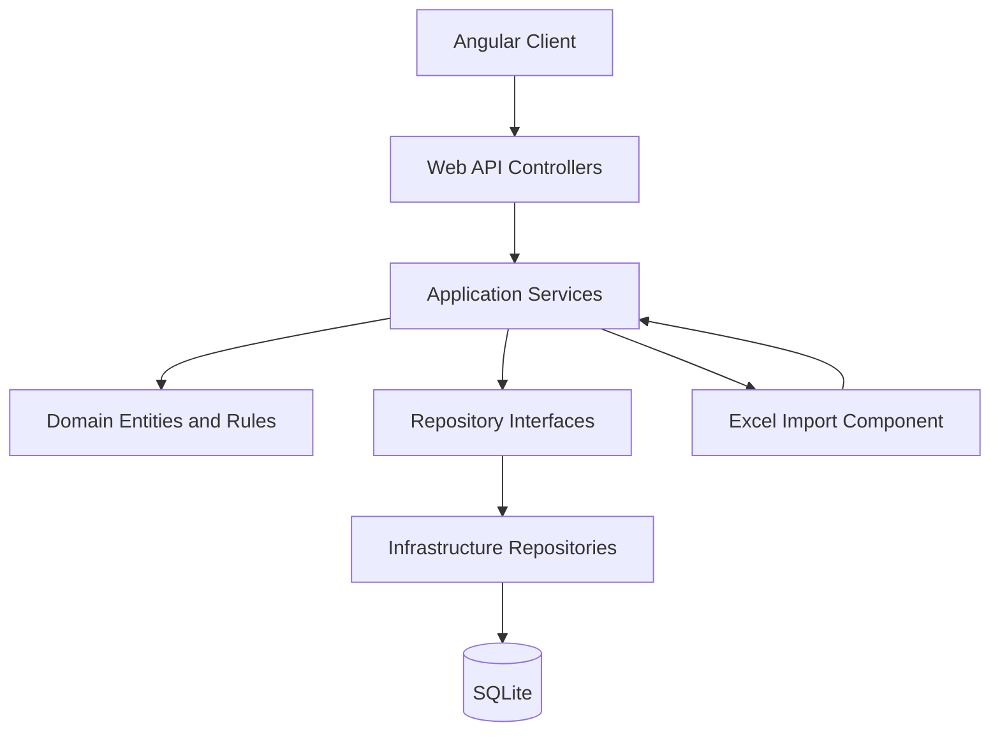

# ארכיטקטורת המערכת

## תרשים שכבות



## צד לקוח

```text
src/app
├── core
│   ├── models
│   └── services
├── features
│   ├── premium-methods
│   ├── metrics
│   └── metric-data
├── layout
│   └── components
├── app.routes.ts
└── app.config.ts
```

- `layout` מכיל את התפריט וה־Layout המשותף.
- `features` מחולק לפי תחום עסקי.
- `core/services` מרכז שירותי API משותפים.
- `app.routes.ts` מגדיר ניווט ו־Lazy Loading לכל מסך.
- הטפסים משתמשים ב־Reactive Forms.
- ניהול מצב מקומי מתבצע באמצעות Signals, ללא ספריית State חיצונית.

## צד שרת

```text
src/Premya.Api
├── Controllers
├── Application
│   ├── Interfaces
│   ├── Services
│   └── Imports
├── Domain
│   └── Entities
├── Contracts
└── Infrastructure
    ├── Excel
    ├── Persistence
    └── Repositories
```

- `Controllers` מטפלים ב־HTTP ובבדיקות קלט בסיסיות בלבד.
- `Application/Services` מכילים את תהליכי העבודה והלוגיקה העסקית.
- `Application/Interfaces` מגדיר חוזים בין השכבות.
- `Domain/Entities` מגדיר את הישויות והקשרים המרכזיים.
- `Infrastructure/Repositories` מממש גישה ל־SQLite.
- `Infrastructure/Excel` קורא Excel וממיר אותו למבנה גנרי.
- `Contracts` מכיל בקשות ותשובות של ה־API.

## זרימת קליטת Excel

1. Angular שולח מדד, שנה, תקופה וקובץ.
2. ה־Controller מקבל את הבקשה ומעביר אותה ל־`IImportService`.
3. השירות מפעיל את `IExcelReader` לזיהוי עמודות, סוגים ושורות.
4. מבנה חדש נשמר כ־`FileStructureVersion` חדשה.
5. הנתונים נשמרים במודל EAV דרך `DynamicRecords` ו־`DynamicValues`.
6. הקליטה נשמרת ב־`ImportBatches` ומוחזרת תוצאת קליטה.
7. שליפת הנתונים מבוצעת בעימוד, סינון ומיון בצד השרת.

## שיקולי סקיילביליות במסגרת הדרישה

- עימוד בצד השרת.
- סינון ומיון לפני החזרת הנתונים ללקוח.
- אינדקסים על קשרים ומפתחות חיפוש.
- שמירת מבני Excel בגרסאות במקום שינוי טבלאות בכל שינוי קובץ.
- אפשרות להחליף SQLite ב־SQL Server בשכבת התשתית.
