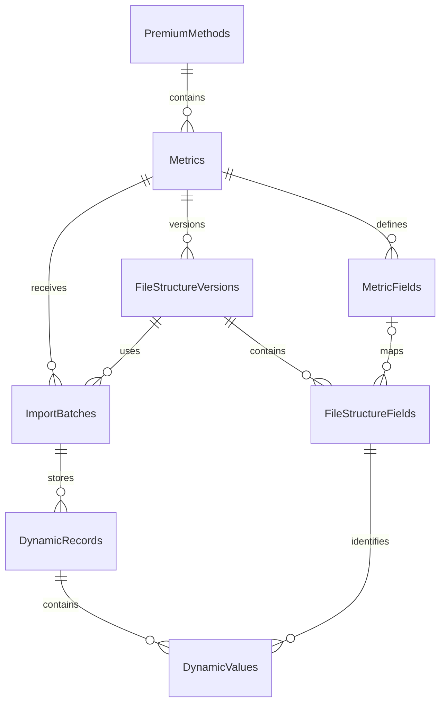

# תרשים ERD ומיפוי הישויות

## תרשים קשרים

## תיאור הישויות

| ישות | אחריות | קשרים עיקריים |
|---|---|---|
| `PremiumMethods` | שיטות הפרמיה | אב של `Metrics` |
| `Metrics` | מדדים המשויכים לשיטה | אב של שדות, גרסאות וקליטות |
| `MetricFields` | הגדרת השדות הלוגיים הרלוונטיים למדד | מיפוי אפשרי לשדה בגרסת קובץ |
| `FileStructureVersions` | גרסאות של מבנה Excel למדד | מכילה שדות ומשויכת לקליטות |
| `FileStructureFields` | שדות שהופיעו בפועל בגרסת קובץ | מזהה את הערכים הדינמיים |
| `ImportBatches` | היסטוריית קליטת קובץ | משויכת למדד ולגרסת מבנה |
| `DynamicRecords` | שורות שנקלטו בקובץ | בן של קליטה |
| `DynamicValues` | ערכים דינמיים של שורה ושדה | בן של רשומה ושדה |

## כללי קשר ואילוצים

- לכל מדד יש שיטת פרמיה אחת.
- שם מדד ייחודי במסגרת שיטת פרמיה.
- לכל גרסת מבנה יש מדד אחד ומספר גרסה ייחודי במסגרת המדד.
- לכל קליטה יש מדד, גרסת מבנה, שנה, תקופה, סטטוס ומספר רשומות.
- `MetricFieldId` ב־`FileStructureFields` יכול להיות ריק עבור שדה חדש שטרם הוגדר במדד.
- לכל רשומה בקובץ יש מספר שורה ייחודי במסגרת הקליטה.
- לכל זוג רשומה ושדה יש ערך דינמי יחיד.
- נתוני קליטות קודמות אינם נמחקים בעת קליטה חדשה.

## מימוש

הישויות ממומשות תחת `src/Premya.Api/Domain/Entities`, והקשרים והאילוצים מוגדרים ב־`PremyaDbContext` וב־EF Core Migration.
